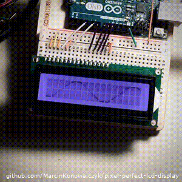

# Pixel-perfect LCD display <!-- omit in toc -->

Typical 16x2 LCD allows one to define up to 8 custom characters. This project shows how to overcome that limit and, in result, be able to control each and every pixel of the LCD screen, at the price of some flickering, and the need for the LCD screen ti be updated every 20 milliseconds (which can, of course, be done concurrently with other processing).

- [Word of caution](#Word-of-caution)
- [Instructions](#Instructions)
- [Explanation](#Explanation)
- [Adapting the code](#Adapting-the-code)
- [Links](#Links)
- [ToDo's](#ToDos)

## Word of caution

Doing this *shouldn't* break your LCD because CGRAM *should* be read-only and if things get messed-up, LCD *should* always start the same way after power cycle. Having said that, my LCD now does not accept normal `lcd.print("...")`'s from `LiquidCrystal` library, even though the CGRAM seems fine when I print it out the library. I can still do anything I want with it, but I have to manually move cursor to the new line and use `lcd.write(...)` to put character on the screen (cursor still advances fine). If you're ok *potentially* making your LCD screen much more... fun to use, read on.

## Instructions

Change the `UPLOAD_PORT` in the makefile to your upload port, and then:

```
make;
make upload;
```

Works only for Arduino UNO, but could absolutely be adapted (see [below](#Adapting-the-code))

Requires [Arduino IDE](https://github.com/arduino/Arduino/) to be installed. The actual compilation, however, does not use it per-say, but it directly talks to the GNU AVR Toolchain which comes with the Arduino IDE.

Currently makefile works only for MacOS, but could be easily adapted to work on other operations systems.


## Explanation

The characters on the LCD are static mappings to a character graphics RAM (CGRAM). When you want to write `Hello World!`, you're just setting the first 12 character blocks on the screen (each 8x5 pixels) to point at positions `48 65 6c 6c 6f 20 57 6f 72 6c 64 21` in the CGRAM. These address are set to match the ASCII codes for the respective characters, at least for the most common characters in english. The table showing the full layout of the CGRAM can be shown on the right.

Most of the CGRAM is read-only, except for the first 8 positions which are left for custom characters. This is not enough for the entire screen and, since this is literally **the** place in memory where these characters are stored, we can't just write them to the screen and then go and use the memory for something else, because the displayed characters would then change accordingly too. Or can we...?

Well, this is the idea behind this project:
 - Blank the entire screen with the `0x20` character which is, conveniently blank
 - Write 8 characters to CGRAM, show them for long enough for the LCD pixels to burn in a bit (ideally about 50ms, but I've used 20 to reduce blinking) and then blank them again
 - Write 8 new custom character to CGRAM. The old characters are not affected because the screen regions are not pointing at them anymore. Blink these characters too.
 - Repeat two more times. This adds up to 32 custom characters covering the entire screen.

If this is done fast enough, the old characters are still on the screen because of the pixel burn-in and human vision persistance (up to, about, 60ms). This creates a display in which every individual pixel on the LCD screen can be set to whatever value. This image will not stay on the screen by themselves though, and will have to keep being updated. The refresh rate is dependant on the character set blinking period, and for 20ms blink period it is roughly 12 Hz (4*20ms each frame).

The refresh rate is also dependant on any other processing which the arduino might be doing. If you plan to use this alongside some heavy-duty computation, it might be worth looking into updating the screen concurrently, and doing work in the blink `delay` gaps.

## Adapting the code

The code works only for Arduino UNO. If you want to make it work with any other board you'll have to edit the pins in `fastio.h` - the input/output library (have a look at the original in MarlinFirmware). You'll also have to adjust the appropriate entries in the `makefile` - `MMCU` and the avrdude -p flag which specifies the AVR device.

If you're not on MacOS, the makefile will not work for you (it won't find correct paths to the AVR toolchain). It shouldn't be hard to adjust. PRs welcome.

More major changes will be required if you want this to work with a full-bus LCD (as opposed to 4-bit mode one), different LCD size or anything of this sort.

## Links

 - https://www.instructables.com/Custom-Large-Font-For-16x2-LCDs/
 - https://arduino.stackexchange.com/questions/46828/how-to-show-the-&#xb0-character-in-a-lcd
 - https://openlabpro.com/guide/custom-character-lcd-pic/

## ToDo's

- [ ] Make makefile work on windows too
- [ ] Different scanning pattern (maybe it'd be better?)
- [x] Fix spacing by accounting for inter-character gaps
- [x] Write explanation section above
- [ ] Wiring diagram
- [ ] Draw a nicer CGRAM table
- [ ] python script to convert an image to an animation...
- [ ] Remove dependency on the Arduino library...?